# 🏗️ Architecture

> System design, data flow, and component map for The Player's Companion.

---

## 📐 High-Level Architecture

```mermaid
flowchart TB
    subgraph Browser["🌐 Browser (Client)"]
        FA["🔐 Firebase Auth"] <--> RA["⚛️ React App (Vite SPA)"]
        RA <--> LS["💽 localStorage"]
    end
    RA -->|"REST API calls"| GEM["🤖 Google Gemini API"]
```



The app is a **fully client-side SPA** — no backend server. All state persists in `localStorage`. AI calls go directly from the browser to Google's Gemini API. Firebase handles authentication only.

---

## 🔄 Application Flow

```mermaid
flowchart TD
    Login["🚪 LoginScreen"] -->|Google Sign-In| FA["🔐 Firebase Auth"]
    Login -->|Guest Mode| Anon["👤 Anonymous Auth / Local Fallback"]
    FA --> CS["📜 CharacterSelection"]
    Anon --> CS

    CS -->|Select existing| Dash["📋 Dashboard"]
    CS -->|Create new| Wiz["🧙 CharacterCreationWizard"]
    CS -->|Delete| CS

    subgraph Wizard["🧙 Creation Wizard (6 Steps)"]
        W1["1. Identity"] --> W2["2. Ability Scores"]
        W2 --> W3["3. Skill Proficiencies"]
        W3 --> W4["4. Spells & Cantrips"]
        W4 --> W5["5. Character Concept"]
        W5 --> W6["6. Review + AI Portrait"]
    end
    Wiz --> W1
    W6 --> Dash

    subgraph DashboardModals["📋 Dashboard"]
        Cards["🃏 CardStack"]
        Detail["🔍 DetailOverlay"]
        Dice["🎲 DiceRollModal"]
        LvlUp["⬆️ LevelUpModal"]
        Rest["🛏️ RestModal"]
        Shop["🏪 ShopModal"]
        DM["🤖 AskDMModal"]
        Settings["⚙️ SettingsModal"]
        Portrait["🎨 PortraitGenerator"]
    end
    Dash --> Cards
```



---

## 🧱 Component Map

### 🏠 Root Layer

| Component | File | Responsibility |
|-----------|------|---------------|
| `App` | `App.tsx` | Auth gate, routing between selection/dashboard |
| `AuthProvider` | `contexts/AuthContext.tsx` | Firebase auth state, sign-in/out methods, React context |
| `CharacterProvider` | `contexts/CharacterContext.tsx` | Character CRUD, Firestore/localStorage dual-mode, migration |

### 📜 Selection Layer

| Component | File | Responsibility |
|-----------|------|---------------|
| `LoginScreen` | `components/LoginScreen.tsx` | Google sign-in button, guest mode |
| `CharacterSelection` | `components/CharacterSelection.tsx` | Character list, create/delete, campaign management |
| `CampaignManager` | `components/CampaignManager.tsx` | Create/join campaigns with shareable codes |

### 🧙 Creation Layer

| Component | File | Responsibility |
|-----------|------|---------------|
| `CharacterCreationWizard` | `components/CharacterCreationWizard.tsx` | 6-step wizard with internal step components (`StepIdentity`, `StepAbilityScores`, `StepSkills`, `StepPowers`, `StepConcept`, `StepReview`) |

### 📋 Dashboard Layer

| Component | File | Responsibility |
|-----------|------|---------------|
| `Dashboard` | `components/Dashboard.tsx` | Main character view shell, modal orchestration |
| `CardStack` | `components/CardStack.tsx` | Swipeable card-stack UI for stat categories |
| `DetailOverlay` | `components/DetailOverlay.tsx` | Fullscreen detail view wrapper with slide animation |

### 🔍 Detail Views (`components/details/`)

| Component | View | Key Data |
|-----------|------|----------|
| `VitalsDetail` | ❤️ Vitals | HP, AC, speed, hit dice, conditions |
| `CombatDetail` | ⚔️ Combat | Attacks, initiative, actions |
| `SkillsDetail` | 🎯 Skills | 18 skills with proficiency/expertise |
| `FeaturesDetail` | ✨ Features | Class/racial features with full text |
| `SpellsDetail` | 📖 Spells | Spellbook, slot tracking, casting |
| `InventoryDetail` | 🎒 Inventory | Items, gold, equip/unequip, encumbrance |
| `JournalDetail` | 📓 Journal | Session notes, NPC log, AI chronicles |

### 🎛️ Modal Components

| Component | File | Trigger |
|-----------|------|---------|
| `DiceRollModal` | `components/DiceRollModal.tsx` | Tap any rollable stat |
| `LevelUpModal` | `components/LevelUpModal.tsx` | Level up button on dashboard |
| `RestModal` | `components/RestModal.tsx` | Rest button on vitals |
| `ShopModal` | `components/ShopModal.tsx` | Shop button on inventory |
| `AskDMModal` | `components/AskDMModal.tsx` | DM button on dashboard |
| `ItemDetailModal` | `components/ItemDetailModal.tsx` | Tap item/feature for AI lookup |
| `SettingsModal` | `components/SettingsModal.tsx` | Settings gear icon |
| `PortraitGenerator` | `components/PortraitGenerator.tsx` | Tap portrait on dashboard |
| `TranscriptionButton` | `components/TranscriptionButton.tsx` | Mic icon on text fields |

---

## 💾 Data Model

### 📊 Core Type: `CharacterData`

```typescript
interface CharacterData {
  id: string;
  ownerUid?: string;                     // Firebase Auth UID (set for cloud users)
  createdAt?: number;                    // epoch ms
  updatedAt?: number;                    // epoch ms (auto-set on every save)
  name: string;
  race: string;
  class: string;
  background?: string;
  alignment?: string;
  level: number;
  campaign?: string;
  portraitUrl: string;
  stats: Record<StatKey, Stat>;       // STR, DEX, CON, INT, WIS, CHA
  hp: { current: number; max: number };
  hitDice: { current: number; max: number; die: string };
  ac: number;
  initiative: number;
  speed: number;
  passivePerception: number;
  skills: Skill[];                     // 18 D&D skills
  attacks: Attack[];
  features: Feature[];
  spells: Spell[];
  spellSlots: { level: number; current: number; max: number }[];
  inventory: { gold: number; items: Item[]; load: string };
  journal: JournalEntry[];
}
```

See `types.ts` for all interfaces (`Stat`, `Skill`, `Attack`, `Feature`, `Spell`, `Item`, `JournalEntry`, `Campaign`, `UserProfile`, `RollResult`).

### 💽 Persistence

| Data | Storage (Google users) | Storage (Guests) | Key/Collection |
|------|----------------------|-------------------|----------------|
| Characters | Cloud Firestore | `localStorage` | `characters` collection / `vesper_chars` |
| Campaigns | `localStorage` | `localStorage` | `vesper_campaigns` |
| Auth session | Firebase Auth | Firebase Auth / local | Managed by Firebase SDK |

**Firestore Schema:**
- Collection: `characters` (top-level)
- Document ID: `character.id` (client-generated UUID)
- Partition field: `ownerUid` (Firebase Auth UID)
- Composite index: `ownerUid` ASC + `updatedAt` DESC
- Security rules: Users can only read/write documents where `ownerUid == auth.uid`

**Dual-mode logic** is managed by `CharacterContext`:
- On auth change: subscribes to Firestore (`onSnapshot`) for Google users, loads localStorage for guests
- Writes are debounced (500ms) to avoid excessive Firestore operations during combat
- Failed Firestore connections fall back to localStorage

> ℹ️ Campaign data is still localStorage-only. Firestore migration for campaigns is planned for the Party System epic.

---

## 🤖 AI Integration

### Models Used

| Model | Purpose | Used By |
|-------|---------|---------|
| `gemini-3-flash-preview` | Text generation (rules, level-up, DM chat) | `lib/gemini.ts`, `LevelUpModal`, `AskDMModal`, `ItemDetailModal`, `JournalDetail` |
| `gemini-2.5-flash-image` | Image generation (portraits) | `CharacterCreationWizard`, `PortraitGenerator` |

### Gemini Client (`lib/gemini.ts`)

Two exported functions:

- **`generateWithContext(prompt, config?)`** — Single-shot text generation
- **`createChatWithContext(history, systemInstruction)`** — Multi-turn chat session

Both use the `GEMINI_API_KEY` injected by Vite at build time via `process.env.API_KEY`.

### Rate Limiting (`utils.ts`)

- `checkRateLimit()` — Enforces a 2-second minimum between AI calls
- Throws a themed error if called too fast

---

## ⚙️ Build & Configuration

### Vite (`vite.config.ts`)

```typescript
define: {
  'process.env.API_KEY': JSON.stringify(env.GEMINI_API_KEY),
  'process.env.GEMINI_API_KEY': JSON.stringify(env.GEMINI_API_KEY)
}
```

Environment variables from `.env` are injected as build-time constants. Firebase config uses `VITE_` prefixed vars which Vite exposes natively.

### Styling

Tailwind CSS is loaded via the `@tailwindcss/vite` plugin with tree-shaken CSS. The app uses Tailwind utility classes throughout with a dark zinc-based theme.

---

## 🧮 D&D Game Data (`constants.tsx`)

All PHB reference data lives in `constants.tsx` as typed exports:

| Export | Description |
|--------|-------------|
| `DND_RACES` | 9 races with subraces, speed |
| `DND_CLASSES` | 12 classes with hit die, saves, skills, caster info, ASI levels |
| `RACIAL_BONUSES` | Ability score bonuses per race |
| `RACE_TRAITS` | Racial features, languages, darkvision, racial spells |
| `CLASS_FEATURES` | Feature progression tables per class (level 1–20) |
| `FULL_CASTER_SLOTS` | Spell slot table for full casters (levels 1–20) |
| `HALF_CASTER_SLOTS` | Spell slot table for Paladin/Ranger |
| `WARLOCK_PACT_SLOTS` | Pact Magic slots per level |
| `CANTRIPS_KNOWN` | Cantrips known at level thresholds |
| `SPELLS_KNOWN` | Spells known for known-caster classes |
| `CLASS_CANTRIPS` | Cantrip lists per class |
| `CLASS_SPELLS_1ST` | 1st-level spell lists per class |
| `SHOP_INVENTORY` | Equipment shop items |

### Helper Functions

| Function | Returns |
|----------|---------|
| `getClassFeatures(className, level)` | Features gained at that level |
| `getSpellSlotsForLevel(className, charLevel)` | Spell slots array |
| `getCantripsKnownCount(className, charLevel)` | Number of cantrips known |
| `getSpellsKnownCount(className, charLevel)` | Number of spells known |
| `isASILevel(className, level)` | Whether level grants ASI |
| `isExpertiseLevel(className, level)` | Whether level grants expertise |
| `getSneakAttackDice(rogueLevel)` | Sneak attack dice string |
| `recalculateCharacterStats(data)` | Recompute AC, attacks, passive perception |
