# ⚜️ The Architect's Blueprints ⚜️

> *"Before the first stone was laid, the Architect drew these plans.  
> Within them lies the fundamental structure of the Companion —  
> its chambers, its passages, and the flow of magical energy throughout."*
>
> System design, data flow, and component map for The Player's Companion.

---

## Chapter 1: High-Level Architecture

> *A bird's-eye view of the realm, as seen from a wizard's tower.*

```mermaid
flowchart TB
    subgraph Browser["🌐 The Material Plane (Browser)"]
        FA["🔐 Firebase Auth"] <--> RA["⚛️ React App (Vite SPA)"]
        RA <--> LS["💽 localStorage"]
    end
    RA -->|"REST API calls"| GEM["🤖 The Weave (Google Gemini API)"]
```



The app is a **fully client-side SPA** — no backend server stands between the adventurer and their data. Character state persists in **Cloud Firestore** for signed-in users and `localStorage` for guest adventurers. AI calls travel directly from the browser to Google's Gemini API. Firebase guards the gates of authentication.

---

## Chapter 2: Application Flow

> *The journey every adventurer takes through the Companion, from the tavern door  
> to the dungeon depths.*

```mermaid
flowchart TD
    Login["🚪 The Tavern Door (LoginScreen)"] -->|Google Sign-In| FA["🔐 Firebase Auth"]
    Login -->|Guest Mode| Anon["👤 Anonymous Auth / Local Fallback"]
    FA --> CS["📜 The Heroes' Gallery"]
    Anon --> CS

    CS -->|Select existing| Dash["📋 The Dashboard"]
    CS -->|Create new| Wiz["🧙 The Ritual of Creation"]
    CS -->|Delete| CS

    subgraph Wizard["🧙 The Ritual of Creation (6 Steps)"]
        W1["1. Identity — Name, Race, Class"] --> W2["2. Ability Scores"]
        W2 --> W3["3. Skill Proficiencies"]
        W3 --> W4["4. Spells & Cantrips"]
        W4 --> W5["5. Character Concept"]
        W5 --> W6["6. Review + AI Portrait"]
    end
    Wiz --> W1
    W6 --> Dash

    subgraph DashboardModals["📋 The Dashboard"]
        Cards["🃏 The Deck of Many Stats"]
        Detail["🔍 The Scrying Glass"]
        Dice["🎲 The Dice Tower"]
        LvlUp["⬆️ The Ascension Chamber"]
        Rest["🛏️ The Campfire"]
        Shop["🏪 The Merchant's Stall"]
        DM["🤖 The Oracle's Chamber"]
        Settings["⚙️ The Tinkerer's Bench"]
        Portrait["🎨 The Portrait Gallery"]
    end
    Dash --> Cards
```



---

## Chapter 3: Component Map

> *Every chamber in the Companion has a purpose. Here is the registry,  
> organized by the layer of the keep in which each component dwells.*

### 🏠 The Root Layer

| Component | File | Responsibility |
|:----------|:-----|:---------------|
| `App` | `App.tsx` | Auth gate, routing between selection and dashboard |
| `AuthProvider` | `contexts/AuthContext.tsx` | Firebase auth state, sign-in/out methods, React context |
| `CharacterProvider` | `contexts/CharacterContext.tsx` | Character CRUD, Firestore/localStorage dual-mode, migration |
| `CampaignProvider` | `contexts/CampaignContext.tsx` | Campaign CRUD, real-time subscriptions, invites |

### 📜 The Selection Layer

| Component | File | Responsibility |
|:----------|:-----|:---------------|
| `LoginScreen` | `components/LoginScreen.tsx` | Google sign-in button, guest adventurer mode |
| `CharacterSelection` | `components/CharacterSelection.tsx` | Character list, create/delete, campaign management |
| `CampaignManager` | `components/CampaignManager.tsx` | Create/join campaigns with shareable codes |

### 🧙 The Creation Layer

| Component | File | Responsibility |
|:----------|:-----|:---------------|
| `CharacterCreationWizard` | `components/CharacterCreationWizard.tsx` | 6-step wizard with internal step components (`StepIdentity`, `StepAbilityScores`, `StepSkills`, `StepPowers`, `StepConcept`, `StepReview`) |

### 📋 The Dashboard Layer

| Component | File | Responsibility |
|:----------|:-----|:---------------|
| `Dashboard` | `components/Dashboard.tsx` | Main character view shell, modal orchestration |
| `CardStack` | `components/CardStack.tsx` | Swipeable card-stack UI for stat categories |
| `DetailOverlay` | `components/DetailOverlay.tsx` | Fullscreen detail view wrapper with slide animation |

### 🔍 The Detail Views (`components/details/`)

| Component | View | Key Data |
|:----------|:-----|:---------|
| `VitalsDetail` | ❤️ The Life Force | HP, AC, speed, hit dice, conditions |
| `CombatDetail` | ⚔️ The Armory | Attacks, initiative, actions |
| `SkillsDetail` | 🎯 The Training Grounds | 18 skills with proficiency/expertise |
| `FeaturesDetail` | ✨ The Hall of Abilities | Class/racial features with full text |
| `SpellsDetail` | 📖 The Spellbook | Spellbook, slot tracking, casting |
| `InventoryDetail` | 🎒 The Bag of Holding | Items, gold, equip/unequip, encumbrance |
| `JournalDetail` | 📓 The Chronicle | Session notes, NPC log, AI chronicles |

### 🎛️ The Modals

| Component | File | Trigger |
|:----------|:-----|:--------|
| `DiceRollModal` | `components/DiceRollModal.tsx` | Tap any rollable stat |
| `LevelUpModal` | `components/LevelUpModal.tsx` | Level up button on dashboard |
| `RestModal` | `components/RestModal.tsx` | Rest button on vitals |
| `ShopModal` | `components/ShopModal.tsx` | Shop button on inventory |
| `AskDMModal` | `components/AskDMModal.tsx` | DM button on dashboard |
| `ItemDetailModal` | `components/ItemDetailModal.tsx` | Tap any item/feature for AI rules lookup |
| `SettingsModal` | `components/SettingsModal.tsx` | Settings gear icon |
| `PortraitGenerator` | `components/PortraitGenerator.tsx` | Tap portrait on dashboard |
| `TranscriptionButton` | `components/TranscriptionButton.tsx` | Mic icon on text fields |

---

## Chapter 4: The Data Model

> *"A character is more than a name and a sword. Here lies the schema  
> that defines every hero in the Companion's vault."*

### 📊 Core Type: `CharacterData`

```typescript
interface CharacterData {
  id: string;
  ownerUid?: string;                     // Firebase Auth UID (cloud users)
  createdAt?: number;                    // epoch ms
  updatedAt?: number;                    // epoch ms (auto-set on every save)
  name: string;
  race: string;
  class: string;
  background?: string;
  alignment?: string;
  level: number;
  campaign?: string;
  portraitUrl: string;
  stats: Record<StatKey, Stat>;       // STR, DEX, CON, INT, WIS, CHA
  hp: { current: number; max: number };
  hitDice: { current: number; max: number; die: string };
  ac: number;
  initiative: number;
  speed: number;
  passivePerception: number;
  skills: Skill[];                     // 18 D&D skills
  attacks: Attack[];
  features: Feature[];
  spells: Spell[];
  spellSlots: { level: number; current: number; max: number }[];
  inventory: { gold: number; items: Item[]; load: string };
  journal: JournalEntry[];
}
```

See `types.ts` for all interfaces (`Stat`, `Skill`, `Attack`, `Feature`, `Spell`, `Item`, `JournalEntry`, `Campaign`, `UserProfile`, `RollResult`).

### 💽 Persistence

> *Where do heroes go when the browser closes?*

| Data | Storage (Google Users) | Storage (Guests) | Key / Collection |
|:-----|:----------------------|:------------------|:-----------------|
| Characters | Cloud Firestore | `localStorage` | `characters` collection / `vesper_chars` |
| Campaigns | Cloud Firestore | `localStorage` | `campaigns` collection / `vesper_campaigns` |
| Auth Session | Firebase Auth | Firebase Auth / local | Managed by Firebase SDK |

**Firestore Schema:**
- Collection: `characters` (top-level)
- Document ID: `character.id` (client-generated UUID)
- Partition field: `ownerUid` (Firebase Auth UID)
- Composite index: `ownerUid` ASC + `updatedAt` DESC
- Security rules: Users can only read/write documents where `ownerUid == auth.uid`

**Dual-mode logic** is managed by `CharacterContext`:
- On auth change: subscribes to Firestore (`onSnapshot`) for Google users, loads localStorage for guests
- Writes are debounced (500ms) to avoid excessive Firestore operations during combat
- Failed Firestore connections fall back to localStorage

---

## Chapter 5: AI Integration

> *"The Weave connects all magic in the world.  
> Through it, the Companion channels the power of Gemini."*

### Models Used

| Model | Purpose | Summoned By |
|:------|:--------|:------------|
| `gemini-2.5-flash` | Text generation (rules, level-up, DM chat, quick roll) | `lib/gemini.ts` → `LevelUpModal`, `AskDMModal`, `ItemDetailModal`, `JournalDetail`, `QuickRollModal` |
| `gemini-2.5-flash-image` | Image generation (portraits) | `lib/gemini.ts` → `CharacterCreationWizard`, `PortraitGenerator`, `QuickRollModal` |

### The Gemini Client (`lib/gemini.ts`)

Three exported incantations:

- **`generateWithContext(prompt, config?)`** — Single-shot text generation
- **`createChatWithContext(history, systemInstruction)`** — Multi-turn chat session
- **`generatePortrait(prompt, parts?)`** — Image generation via `gemini-2.5-flash-image`, returns base64 data URI or null

All use the `GEMINI_API_KEY` injected by Vite at build time via `process.env.API_KEY`. The `getAI()` private factory validates the key exists before creating a `GoogleGenAI` instance.

---

<p align="center"><em>⚔️ Thus concludes the Architect's Blueprints. ⚔️</em></p>
